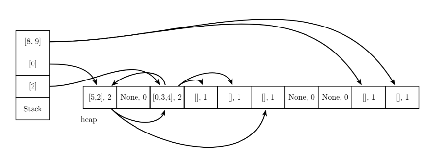
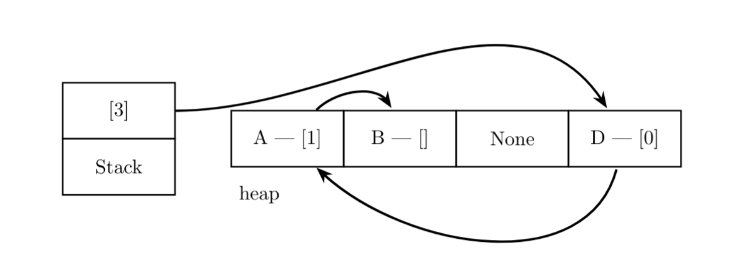
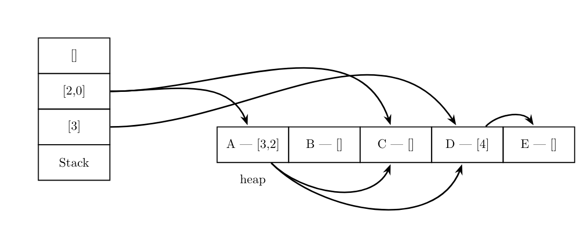
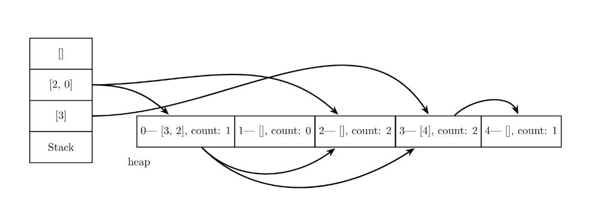

# Project 7: Garbage Collector
**Due**:  Tuesday, May 13th, 11:59PM (Late: Wednesday, May 14th, 11:59PM)\
**Points**: Public: 45, Semipublic: 55 

## Introduction
In this project, we will be implementing versions of the *reference counting*, *mark and sweep*, and *stop and copy* garbage collection algorithms. See [Cliff's notes](https://bakalian.cs.umd.edu/assets/notes/gc.pdf) for more details about these forms of garbage collection.

### Ground Rules

This is an individual assignment. You may use functions found in Rust's standard
library. You may write any helper functions that you wish. 
You may not use `unsafe` or any external crates.

> [!NOTE]
> In this project, we represent the stack and heap using vecs, with the semantics changing slightly for each strategy.\
> **Please read [About Memory](#about-representation-of-data-in-this-project) BEFORE you begin!**


**Implement the following functions in `src/garbage_coll.rs`**

## Reference Counting

`pub fn reference_counting(string_vec: Vec<String>) -> RefCountMem`

This function inputs a `Vec` with a list of actions taken by a program and outputs the memory layout after the program fully executes.\
**You Will**: Build a heap with reference counts for all the data in the file, as well as the corresponding stack. 

In `utils.rs`, we give you a `int_of_string` function that takes in a `String` and turns that string into an integer. 

>[!IMPORTANT]
> For `reference_counting` *only*, we are going to say that the heap you should create is a set size of 10. In every other function, you may be given heaps of any size, and they will remain that size.
>  
> Note the main difference between RefCountMem and Memory is that RefCountMem has a place for the reference count rather than the name of the memory address.

There are 2 possible actions that can be done.  

We can or `Ref`(erence) memory from the stack or heap or `Pop` to remove the most recent stack frame.

In order to determine which action to take, you're encouraged to use regex. You can assume all inputs will follow the format below (i.e. all inputs will be syntactically valid). You may also assume we will not give you indices that go out of bounds.

The possible instructions are:
- `Ref Heap <integer1> <0 or more integers>` allocates memory in the heap in index integer1. In this memory, there should be an option that contains a list with each of the subsequent integers. This is creating references between integer1 and all subsequent integers.
- `Ref Stack <0 or more integers>` Should add an element to the stack, which references the data on the heap represented by the integer(s)
- `Pop` Removes the most recent stack frame.


If memory is allocated to somewhere on the heap that is not referenced by anything, you can safely "ignore" that line
(It's reference count would be 0, so it would be immediately deallocated). You may also ignore lines that `Pop` after all 
stack frames have been removed. Neither of these will result in errors, though.

You will return the `RefCountMem` struct representing the state of memory after all of the program actions have been taken. See [About Memory](#about-representation-of-data-in-this-project) for more info on this struct and what it represents. If the reference count ever reaches 0, deallocate that memory (change it to None).

If an index on the heap is referenced, but never references anything itself, it will be `Some([], <rfcount>)`

Examples: 

basic.txt:
```txt
Ref Stack 2
Ref Heap 2 0 3 4
Ref Stack 0
Ref Stack 8 9
Ref Heap 0 5 2
Pop
Pop
```

Diagram of each step:

- Before any step


- Ref Stack 2


- Ref Heap 2 0 3 4


- Ref Stack 0


- Ref Stack 8 9


- Ref Heap 0 5 2



- Pop


- Pop


```rust
// reference_counting("basic.txt") returns 
RefCountMem {
        stack: vec![vec![2]],
        heap: vec![(Some(vec![5, 2]), 1), (None, 0), (Some(vec![0,3,4]), 2), 
            (Some(vec![]), 1), (Some(vec![]), 1), (Some(vec![]), 1), (None, 0), 
            (None, 0), (None, 0), (None, 0)],
}
```

example2.txt:

```txt
Ref Stack 0 1
Ref Heap 1 3 2 5
Pop 
```

- Ref Stack 0 1


- Ref Heap 1 3 2 5


- Pop (including each free step)


This will return: 


```rust
// reference_counting("basic.txt") returns 
RefCountMem {
        stack: vec![],
        heap: vec![(None, 0), (None, 0), (None, 0), 
            (None, 0), (None, 0), (None, 0), (None, 0), 
            (None, 0), (None, 0), (None, 0)],
}
```

## Mark and Sweep

`pub fn mark_and_sweep(mem: &mut Memory) -> ()`

**For this function, we have given you a stub for a helper function called `reachable`. Though it is not directly tested, we HIGHLY recommend you implement this or something similar. It will also help you with Stop and Copy.**

Given a Memory struct, your job is to perform the Mark and Sweep garbage collection on the Heap. Your function will modify the Memory that is passed in rather than creating and returning a new one.


Examples:
```rust
let input_heap: Vec<Option<(String, Vec<u32>)>> = vec![Some(("A".to_string(), vec![1])), Some(("B".to_string(), vec![])), Some(("C".to_string(), vec![])), Some(("D".to_string(), vec![0]))];

let expected = vec![Some(("A".to_string(), vec![1])), Some(("B".to_string(), vec![])), None, Some(("D".to_string(), vec![0]))];

let mut mem = Memory {
    stack : vec![vec! [3]],
    heap: input_heap,
};

mark_and_sweep(&mut mem);
assert_eq!(expected, mem.heap); 
```

Diagram: 

- Before Mark and Sweep


- After Mark and Sweep




```rust
let input_heap: Vec<Option<(String, Vec<u32>)>> = vec![Some(("A".to_string(), vec![1, 2])), Some(("B".to_string(), vec![3])), Some(("C".to_string(), vec![3])), Some(("D".to_string(), vec![2]))];

let expected = vec![None, None,  Some(("C".to_string(), vec![3])), Some(("D".to_string(), vec![2]))];

let mut mem = Memory {
    stack : vec![vec! [3]],
    heap: input_heap,
};

mark_and_sweep(&mut mem);
assert_eq!(expected, mem.heap); 
```

Diagrams: 

- Before Mark and Sweep: 


- After Mark and Sweep: 


## Stop and Copy

`pub fn stop_and_copy<'a>(mem: &mut Memory<'a>, alive: u32) -> ()`

Stop and Copy tries to solve the problem of fragmentation. In this function, you are given a Memory struct representing the memory at the time the program stops, as well as an integer called `alive`. You may assume all heaps given to you have an even length.  

Meaning of the `alive` flag:
- 0 represents a heap where the left half is `alive` and the right half is `dead`.
- 1 represents a heap where the left half is `dead` and the right half is `alive`.
  
The goal of this function is to copy referenced data from the currently `alive`/active half into the new currently `dead` half. Once the data is copied, the runtime would switch the `alive` flag, activating the new (formerly `dead`) side, resulting in a much more compact active heap. You will not need to switch the flag, you are only responsible for updating the memory to be *ready* for switching.
Both sides of the heap may have memory inside them since *stop and copy* **does not clear** `alive` memory after copying.

**You will**: Copy all reachable memory from the `alive` half into `dead` half. Do not clear the original `alive` half.\
**The data copied into the `dead` half must be contiguous**, starting from the left of the `dead` section.

Remember, data in both the stack and heap can reference other data (represented by the option type). It is guarenteed that entries in the `alive` section of the heap will never reference entries in the `dead` sections and vice versa. When you move data, you must maintain that all of its references are updated to the **new** location in the `dead` half, ensuring that they point to the same data after the copy. You can use the "names" of the heap data to ensure this. This means you will likely have to update references in both the stack and the heap.

The data in the `dead` half of the heap can be in any order, as long as the above conditions are met.

The stack and heap are represented the same way that they are in mark and sweep. You will again have to modify `mem` in place. This function does not return anything.

Please note that the public tests for stop and copy are very limited. You will have to do a lot of your own testing to ensure that you function is working as expected. The named data is there to help you debug. Make sure that everything that should be reachable from the stack is by using the names of the data. 

Examples:
```rust
    let mut mem = Memory {
        stack : vec! [vec! [3]],
        heap : vec! [Some(("A".to_string(), vec![1])), Some(("B".to_string(), vec![0])), Some(("C".to_string(), vec![])), Some(("D".to_string(), vec![0])),  Some(("E".to_string(), vec![7])), Some(("F".to_string(), vec![])), Some(("G".to_string(), vec![5, 4])), Some(("H".to_string(), vec![]))]
    };

    stop_and_copy(&mut mem, 0);

    let expected = Memory {
        stack : vec! [vec! [6]],
        heap :  vec! [Some(("A".to_string(), vec![1])), Some(("B".to_string(), vec![0])), Some(("C".to_string(), vec![])), Some(("D".to_string(), vec![0])), Some(("A".to_string(), vec![5])), Some(("B".to_string(), vec![4])), Some(("D".to_string(), vec![4])), None]
    }; // or equivalent

    assert_eq!(mem, expected);
```

Diagram of above example: 

- Initially:


- After Stop and Copy: 


```rust
    let mut mem = Memory {
        stack: vec![vec![6]], 
        heap : vec! [Some(("A".to_string(), vec![1])), Some(("B".to_string(), vec![0])), Some(("C".to_string(), vec![])), Some(("D".to_string(), vec![2])), //dead 
        Some(("E".to_string(), vec![])), None, Some(("F".to_string(), vec![4])), None] // alive
    };
    
    let expected = Memory {
        stack: vec![ vec![1]], 
        heap : vec! [Some(("E".to_string(), vec![])), Some(("F".to_string(), vec![0])), None, None, // alive 
        
        Some(("E".to_string(), vec![])), None, Some(("F".to_string(), vec![4])), None] // dead
    }; // or equivalent
    
    stop_and_copy(&mut mem, 1);
    assert_eq!(mem, expected);
```

Diagram of above example: 

- Initially then after stop and copy


## About Representation of data in this project: 

Note about representations of memory diagrams: 

First, we are representing the stack frame as programs that are pushed onto and popped from the stack rather than individual references within a program. So, items on the stack may reference multiple pieces of data or none at all, since a program may or may not reference data on the heap.

In Mark and Sweep and Stop and Copy, the stack and heap are represented by Vecs with each index (a `Vec<u32>` for stack and a `Option<(String,Vec<u32>)>` type for the heap) representing a memory address. These slices live inside the Memory struct. For example:

```rust 
Memory {
    stack: vec![vec![3], vec![2,0], vec![]],
    heap: vec![Some("A".to_string(), vec![3, 2]), Some("B".to_string(), vec![]), Some("C".to_string(), vec![]), Some("D".to_string(), vec![4]), Some("E".to_string(), vec![])],
}
```

Represents a memory diagram that appears as follows: 


For reference counting, we modify this slightly, removing the names of memory addresses and replacing that with a space for their reference count. For example:

```rust
pub struct RefCountMem {
    pub stack: vec![vec![3], vec![2,0], vec![]],
    pub heap: Vec<(Option<Vec<u32>>, u32)> 
    vec![(Some(vec![3,2]), 1), (Some(vec![]), 0), (Some(vec![]), 2), (Some(vec![4]), 2), (Some(vec![]), 1)],
}
```

Represents this memory diagram: 

(We included the indicies here to help understanding, but RefCountMem heap entries are unnamed).

**Important Note**: The stack will always be the length of however many programs there are (Hence why the stack is not represented by Option types). However, the stack **may** contain empty lists (some programs don't reference data on the heap at all).

Any pointers to the heap are labeled by their indices in the vec. The information inside the stack and heap entries is the memory that they point to on the heap. The names are for debugging/helper purposes, but are not used for pointers. Memory won't point to itself.

`None` indicates that there is no memory present there in the heap. Freed memory will appear as None. `[]` represents memory that is used, but doesn't point to any other pieces of memory. You may assume nothing in the stack or heap will point to freed memory (None).

Another example of the memory diagrams:

```rust 
Memory {
    stack: vec![vec![0,1], vec![0]],
    heap: [Some("A".to_string(), vec![]), Some("B".to_string(), vec![2, 0]), Some("C".to_string(), vec! [3]), Some("D".to_string(), vec![0]), Some("E".to_string(), vec![]), None, Some("G".to_string(), vec![4]), None]
}
```

Diagram of above: 


